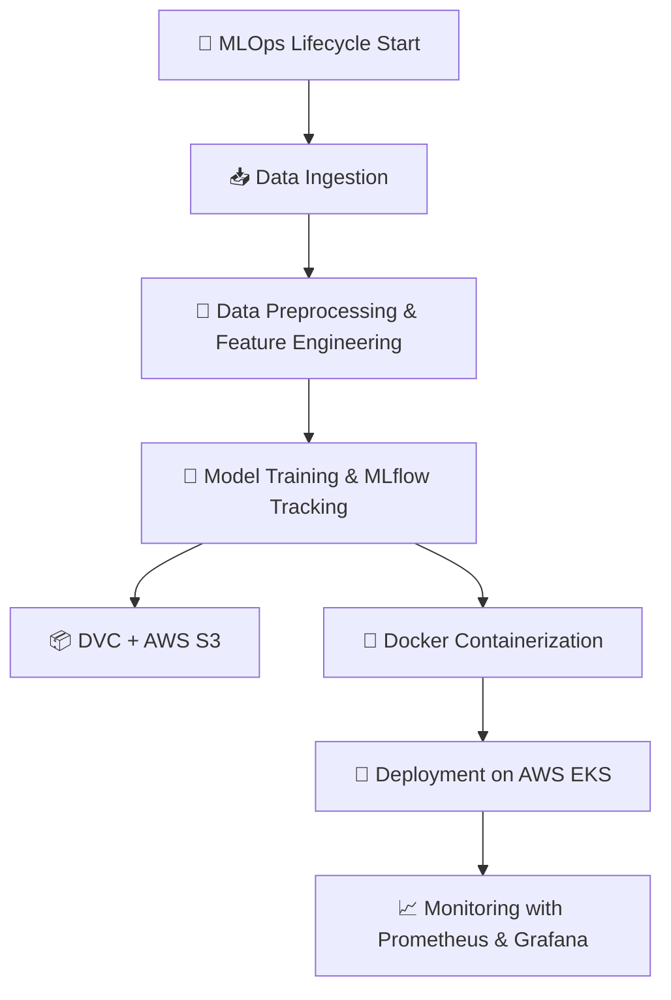
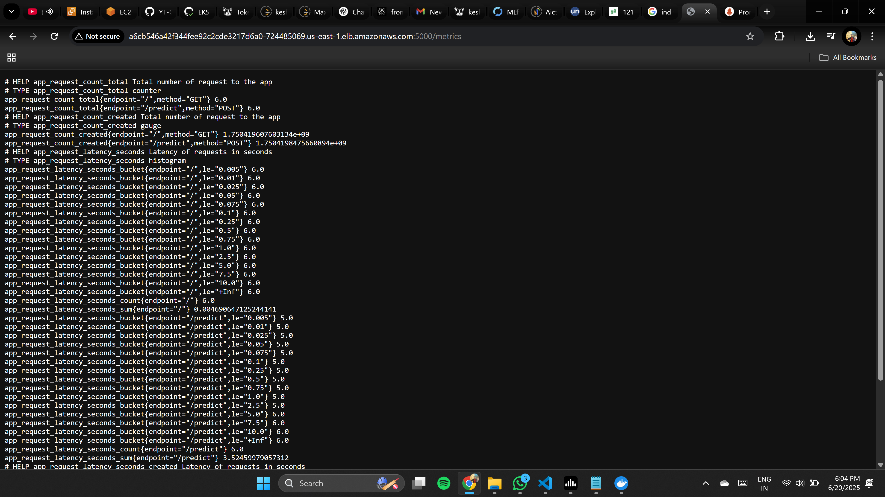
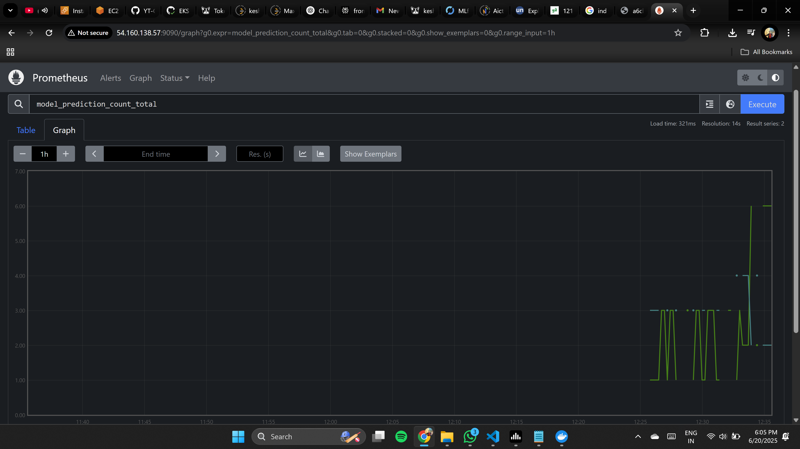
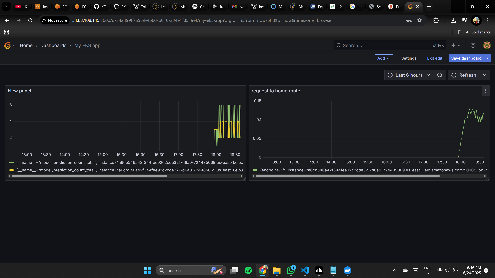

# 🚀 **End-to-End MLOps Project**

A **production-grade machine learning pipeline** that spans the complete lifecycle — from **data ingestion** and **model training** to **deployment on AWS EKS** with full **CI/CD automation** and **real-time monitoring**.

---

## 🌟 **Key Features**

### ✅ MLOps Best Practices

* 🔁 **Reproducible pipelines** using `DVC`
* 🧪 **Experiment tracking** with `MLflow` hosted on Dagshub
* 🤖 **Automated CI/CD** via `GitHub Actions`

### 🐳 Containerization & Scalable Deployment

* 📦 Packaged with `Docker`
* 🚀 Deployed on **AWS EKS (Kubernetes)**
* 🌐 REST API built using `Flask`

### 📈 Monitoring & Observability

* 📊 Metrics with `Prometheus`
* 📉 Dashboards with `Grafana`

### ☁️ Cloud Infrastructure

* 🗂️ `AWS S3` for artifact storage
* 📤 `AWS ECR` for Docker images
* 🔐 `AWS IAM` for secure access management

---

## ⚙️ **Technology Stack**

| Area                   | Tools & Services              |
| ---------------------- | ----------------------------- |
| 📁 Project Structure   | `cookiecutter-data-science`   |
| 🧪 Experiment Tracking | `MLflow`, `Dagshub`           |
| 📦 Data Versioning     | `DVC`, `AWS S3`               |
| 🧪 Environment         | `Conda`, `Pip`, `Docker`      |
| 🚀 Deployment          | `Flask`, `Docker`, `AWS EKS`  |
| 🔄 CI/CD               | `GitHub Actions`              |
| 📈 Monitoring          | `Prometheus`, `Grafana`       |
| ☁ Cloud Services       | `AWS IAM`, `S3`, `ECR`, `EKS` |

---

## 🔄 **MLOps Lifecycle Workflow**


## 📝 **Setup & Flow**

### 🔹 Repository & Structure

✅ Initialize project: `cookiecutter-data-science`
✅ Organize src into: `data_ingestion.py`, `data_preprocessing.py`, `feature_engineering.py`, `model_building.py`, `model_evaluation.py`, `register_model.py`

---

### 🔹 Experiment Tracking

✅ MLflow + Dagshub integrated
✅ All experiments logged and reproducible

---

### 🔹 Data & Model Management

✅ DVC initialized with **local & S3 remotes**
✅ `params.yaml`, `dvc.yaml` for pipeline management
✅ `dvc repro` for full pipeline execution

---

### 🔹 CI/CD Pipeline

✅ GitHub Actions for:

* Code linting & testing
* Docker build & push to ECR
* Kubernetes deployment on EKS

✅ Secrets managed via GitHub & Dagshub tokens

---

### 🔹 Deployment & Scaling

✅ Flask app containerized with **Docker**
✅ EKS cluster setup with **eksctl**
✅ LoadBalancer service exposing API

---

### 🔹 Monitoring

✅ Prometheus scrapes app metrics
✅ Grafana visualizes & alerts on metrics

---

## 🌍 **Cloud Resources**

* **AWS EKS Cluster:** Auto-managed nodes
* **AWS S3:** Model artifacts & datasets
* **AWS ECR:** Container image repository
* **AWS IAM:** Fine-grained access control

---

## 🖥 **Access**

🔗 **Grafana Dashboard:** `http://<grafana-ip>:3000`
🔗 **Prometheus Web UI:** `http://<prometheus-ip>:9090`
🔗 **Flask API:** `http://<load-balancer-ip>:5000`

---

## 🧹 **Cleanup**

✅ Tear down EKS, S3, ECR, EC2, and other AWS resources post-deployment
✅ CloudFormation stacks cleaned

---

## 🤩 **Why this project?**

This project demonstrates **full-cycle MLOps engineering**:
✅ **Reproducibility** (DVC, MLflow)
✅ **Automation** (CI/CD, GitHub Actions)
✅ **Scalability** (Kubernetes on AWS EKS)
✅ **Monitoring** (Prometheus + Grafana)
✅ **Cloud readiness** (S3, ECR, IAM)

---

## 📌 **How to Run**

```bash
# Clone and setup
git clone https://github.com/your-username/your-repo.git
cd your-repo
conda create -n atlas python=3.10
conda activate atlas
pip install -r requirements.txt

# Reproduce pipeline
dvc repro

# Build Docker
docker build -t capstone-app:latest .
docker run -p 8888:5000 -e CAPSTONE_TEST=your-token capstone-app:latest

# Deploy to EKS (via CI or manually)
kubectl apply -f k8s/deployment.yaml
```

---

## 🌟 **Screenshots**

<details>
<summary>App UI</summary>

</details>

<details>
<summary>MLflow UI</summary>

</details>


<details>
<summary>App Metrics</summary>

</details>

<details>
<summary>Prometheus Metrics</summary>

</details>

<details>
<summary>Grafana Dashboard</summary>

</details>

---

## 💡 **Future Enhancements**

* Auto-trigger retraining on data drift
* Canary deployments on Kubernetes
* Advanced metrics: latency, memory, GPU utilization

---

## 📫 **Let’s Connect**

💼 [LinkedIn](https://www.linkedin.com/in/shrishti-singh-t/)
