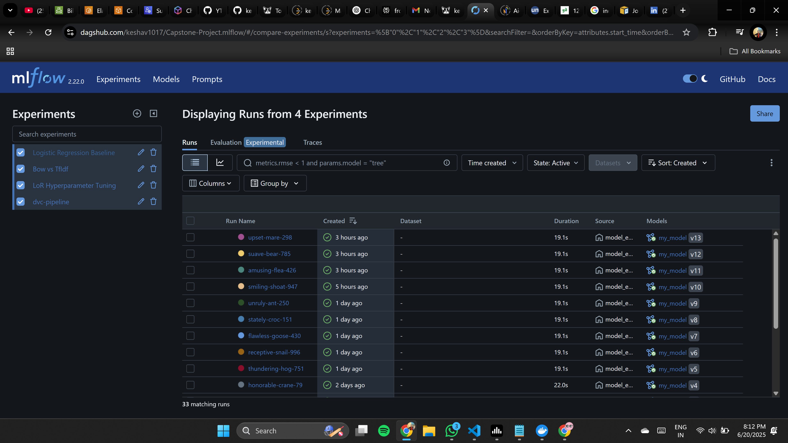

# 🚀 **Capstone MLOps Project**

Welcome to my end-to-end **MLOps Capstone Project** — a production-ready machine learning workflow that covers everything from **data ingestion** to **deployment on Kubernetes (EKS)**, complete with **CI/CD pipelines**, **monitoring**, and **cloud infrastructure**.

---

## 🌟 **Project Highlights**

👉 **MLOps Best Practices:**
✔️ Reproducible pipelines using **DVC**
✔️ Experiment tracking with **MLflow on Dagshub**
✔️ Automated workflows via **GitHub Actions**

👉 **Containerization & Deployment:**
✔️ Packaged with **Docker**
✔️ Deployed on **AWS EKS (Kubernetes)**
✔️ Scalable REST API using **Flask**

👉 **Monitoring & Observability:**
✔️ **Prometheus** for metrics scraping
✔️ **Grafana** for beautiful dashboards

👉 **Cloud-Native Infrastructure:**
✔️ **AWS S3** for artifact storage
✔️ **AWS ECR** for Docker image repository
✔️ **IAM** for secure access

---

## ⚙️ **Tech Stack**

| Category               | Tool/Tech                                 |
| ---------------------- | ----------------------------------------- |
| 🏗️ Project Scaffold   | `cookiecutter-data-science`               |
| 📦 Environment         | `conda`, `pip`, `Docker`                  |
| 📊 Experiment Tracking | `MLflow`, `Dagshub`                       |
| 📁 Data Versioning     | `DVC`, `AWS S3`                           |
| 🚀 Deployment          | `Flask`, `Docker`, `AWS EKS (Kubernetes)` |
| 🔄 CI/CD               | `GitHub Actions`                          |
| 📈 Monitoring          | `Prometheus`, `Grafana`                   |
| ☁ Cloud                | `AWS IAM`, `S3`, `ECR`, `EKS`             |

---

## 🛠️ **Project Workflow**

```mermaid
flowchart TB
  CENTER["🚀 MLOps Lifecycle"]

  %% Data Pipeline
  INGEST["📥 Ingest Data"]
  PREP["🧹 Preprocess + Feature Engg"]
  MODEL["🤖 Train + Track - MLflow"]
  VERSION["📦 DVC + S3"]

  %% Deployment
  DOCKER["🐳 Docker + ECR"]
  K8S["🧬 EKS Deployment"]

  %% Monitoring
  MON["📈 Prometheus + Grafana"]

  %% Connections
  CENTER --> INGEST
  INGEST --> PREP
  PREP --> MODEL
  MODEL --> VERSION
  MODEL --> DOCKER
  DOCKER --> K8S
  K8S --> MON
```



---

## 📝 **Setup & Flow**

### 🔹 Repository & Structure

✅ Initialize project: `cookiecutter-data-science`
✅ Organize src into: `data_ingestion.py`, `data_preprocessing.py`, `feature_engineering.py`, `model_building.py`, `model_evaluation.py`, `register_model.py`

---

### 🔹 Experiment Tracking

✅ MLflow + Dagshub integrated
✅ All experiments logged and reproducible

---

### 🔹 Data & Model Management

✅ DVC initialized with **local & S3 remotes**
✅ `params.yaml`, `dvc.yaml` for pipeline management
✅ `dvc repro` for full pipeline execution

---

### 🔹 CI/CD Pipeline

✅ GitHub Actions for:

* Code linting & testing
* Docker build & push to ECR
* Kubernetes deployment on EKS

✅ Secrets managed via GitHub & Dagshub tokens

---

### 🔹 Deployment & Scaling

✅ Flask app containerized with **Docker**
✅ EKS cluster setup with **eksctl**
✅ LoadBalancer service exposing API

---

### 🔹 Monitoring

✅ Prometheus scrapes app metrics
✅ Grafana visualizes & alerts on metrics

---

## 🌍 **Cloud Resources**

* **AWS EKS Cluster:** Auto-managed nodes
* **AWS S3:** Model artifacts & datasets
* **AWS ECR:** Container image repository
* **AWS IAM:** Fine-grained access control

---

## 🖥 **Access**

🔗 **Grafana Dashboard:** `http://<grafana-ip>:3000`
🔗 **Prometheus Web UI:** `http://<prometheus-ip>:9090`
🔗 **Flask API:** `http://<load-balancer-ip>:5000`

---

## 🧹 **Cleanup**

✅ Tear down EKS, S3, ECR, EC2, and other AWS resources post-deployment
✅ CloudFormation stacks cleaned

---

## 🤩 **Why this project?**

This project demonstrates **full-cycle MLOps engineering**:
✅ **Reproducibility** (DVC, MLflow)
✅ **Automation** (CI/CD, GitHub Actions)
✅ **Scalability** (Kubernetes on AWS EKS)
✅ **Monitoring** (Prometheus + Grafana)
✅ **Cloud readiness** (S3, ECR, IAM)

---

## 📌 **How to Run**

```bash
# Clone and setup
git clone https://github.com/your-username/your-repo.git
cd your-repo
conda create -n atlas python=3.10
conda activate atlas
pip install -r requirements.txt

# Reproduce pipeline
dvc repro

# Build Docker
docker build -t capstone-app:latest .
docker run -p 8888:5000 -e CAPSTONE_TEST=your-token capstone-app:latest

# Deploy to EKS (via CI or manually)
kubectl apply -f k8s/deployment.yaml
```

---

## 🌟 **Screenshots**

<details>
<summary>App UI</summary>

</details>

<details>
<summary>MLflow UI</summary>

</details>


<details>
<summary>App Metrics</summary>

</details>

<details>
<summary>Prometheus Metrics</summary>

</details>

<details>
<summary>Grafana Dashboard</summary>

</details>

---

## 💡 **Future Enhancements**

* Auto-trigger retraining on data drift
* Canary deployments on Kubernetes
* Advanced metrics: latency, memory, GPU utilization

---

## 📫 **Let’s Connect**

💼 [LinkedIn](https://www.linkedin.com/in/keshavprasad1017/)
